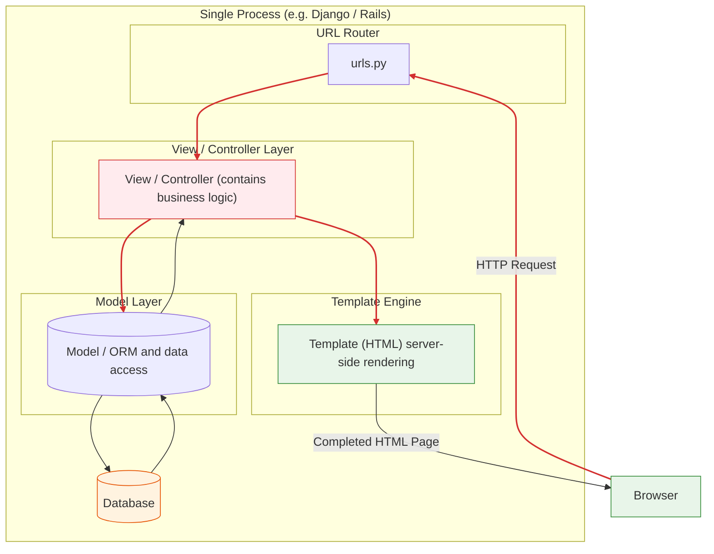
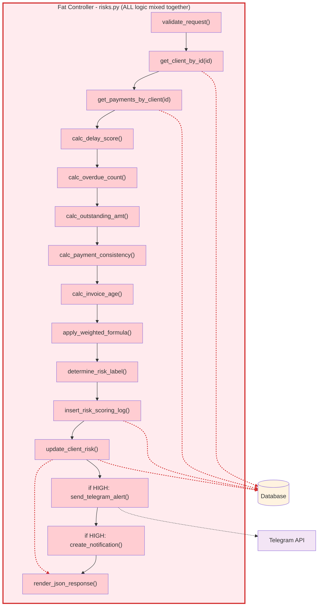
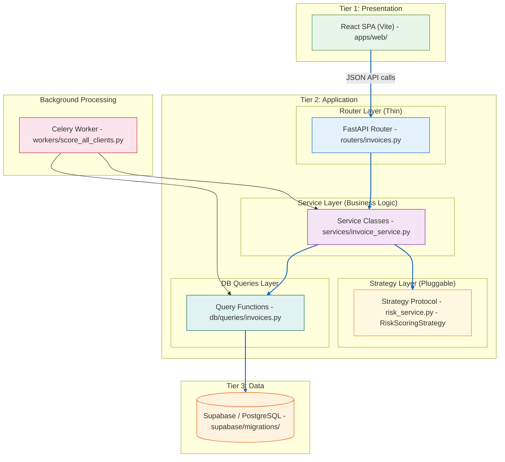
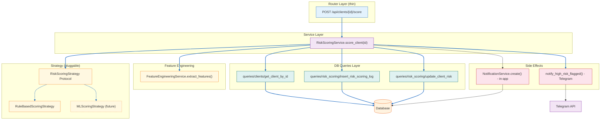

# Architecture Comparison: Traditional Monolith vs Decoupled Architecture

## Traditional Monolithic (MVC/MVT)

**Key characteristics:**
- All code runs in **one process** — the browser receives pre-rendered HTML
- The View/Controller is a **"fat" layer** handling logic, auth, rendering
- The Template Engine is **tightly coupled** to the backend — HTML lives inside the server
- Scaling means scaling **everything** together (vertical scaling)

---

## Zoom In: Risk Scoring Pipeline inside the Monolith

**Every responsibility crammed into one layer:**
- Data access (queries mixed with logic) — steps B, C
- Feature calculation (5 separate metrics) — steps D-H
- Scoring formula and thresholds — steps I, J
- Persistence and updates — steps K, L
- External side effects (Telegram) — step M
- In-app notification logic — step N
- Response rendering — step O

None of these can be reused, tested in isolation, or swapped independently.

---

## Your Architecture (Decoupled / Three-Tier)

**Key characteristics:**
- **Three physical tiers** — Presentation (browser), Application (Docker), Data (Supabase)
- **Router is thin** — owns only HTTP concerns (auth, status codes, validation)
- **Service Layer owns logic** — pure Python, testable without HTTP
- **Strategy Protocol** — scoring formula is pluggable (OCP/DIP via `RiskScoringStrategy`)
- **DB Queries are isolated** — data access lives in dedicated files, not mixed with logic
- **Background worker** — Celery independently calls the same Service Layer (pink node)
- Each component can be **scaled independently**

---

## Zoom In: Risk Scoring Pipeline in Your Architecture

**How it differs from the monolith:**

| Aspect | Monolith Controller | Your Architecture |
|--------|-------------------|-------------------|
| **Data access** | Mixed into controller | Isolated in `db/queries/` |
| **Scoring formula** | Inline in controller function | Pluggable `RiskScoringStrategy` Protocol |
| **Feature extraction** | Inline calculations | `FeatureEngineeringService` |
| **Side effects** (Telegram, notifications) | Hard-coded in controller | Dedicated `NotificationService` + `Telegram` |
| **Reusability** | Cannot reuse without HTTP | Celery worker calls same `score_client()` |
| **Testability** | Need HTTP request + DB mock | Pure async; inject mock strategy + real DB |

---

## At a Glance

| Aspect | Traditional Monolith (Django) | Your Architecture |
|---|---|---|
| **Deployment** | One server process | Browser + Docker + Supabase |
| **Frontend location** | Inside the backend (HTML templates) | Separate app (`apps/web`) |
| **Business logic lives in** | View / Controller (fat) | Service Layer |
| **Database access** | ORM mixed into models | Isolated query files |
| **Background jobs** | Same process or hacky cron | Dedicated Celery worker |
| **Scalability** | Vertical (scale the one server) | Horizontal (scale each tier independently) |
| **Testing logic** | Needs simulated HTTP request | Pure async unit tests |
| **Code organization** | Monorepo *and* monolith | Monorepo *but* decoupled modules |

---

## The Key Insight

> **Monorepo ≠ Monolith.** You share a Git repository for convenience, but your code runs as independent, loosely-coupled systems that communicate over HTTP. A true monolith runs as one process where the frontend, backend, and database access are all interleaved in shared memory.
