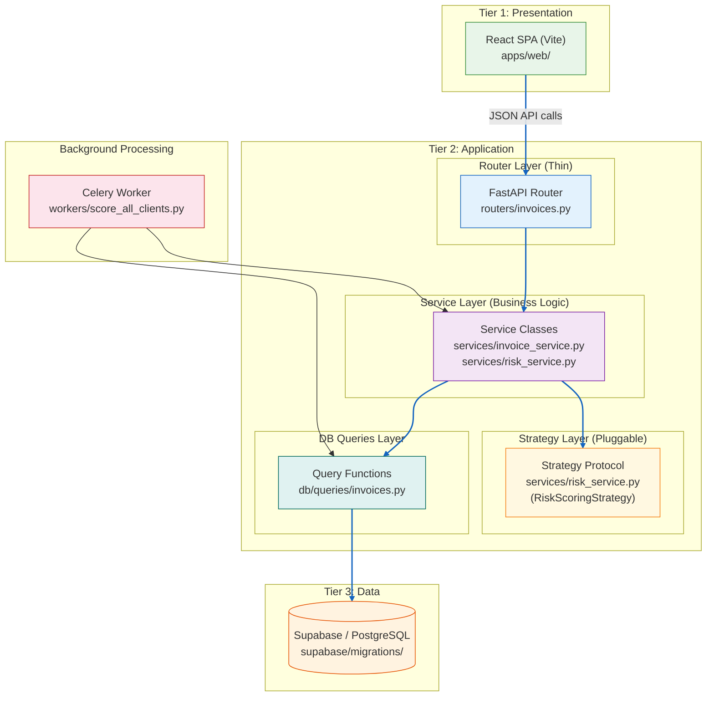

# Architecture Comparison: Traditional Monolith vs Decoupled Architecture

## Traditional Monolithic (MVC/MVT)

```mermaid
flowchart TD
    subgraph "🏠 Single Process (e.g. Django / Rails)"
        direction TB
        
        subgraph "URL Router"
            URL[urls.py]
        end
        
        subgraph "View / Controller Layer"
            VC["View / Controller<br/>(contains business logic)"]
        end
        
        subgraph "Model Layer"
            M[(Model / ORM<br/>(data access)]
        end
        
        subgraph "Template Engine"
            T["Template (HTML)<br/>(server-side rendering)"]
        end
        
        URL --> VC
        VC --> M
        M --> DB[(Database)]
        DB --> M
        M --> VC
        VC --> T
    end

    B1[Browser] -- "HTTP Request" --> URL
    T -- "Completed HTML Page" --> B1

    style B1 fill:#E8F5E9,stroke:#388E3C
    style VC fill:#FFEBEE,stroke:#D32F2F
    style T fill:#E8F5E9,stroke:#388E3C
    style DB fill:#FFF3E0,stroke:#E65100
    linkStyle 0,1,5,6 stroke:#D32F2F,stroke-width:2
```

**Key characteristics:**
- All code runs in **one process** — the browser receives pre-rendered HTML
- The View/Controller is a **"fat" layer** handling logic, auth, rendering
- The Template Engine is **tightly coupled** to the backend — HTML lives inside the server
- Scaling means scaling **everything** together (vertical scaling)

---

## Your Architecture (Decoupled / Three-Tier)



**Key characteristics:**
- **Three physical tiers** — Presentation (browser), Application (Docker), Data (Supabase)
- **Router is thin** — owns only HTTP concerns (auth, status codes, validation)
- **Service Layer owns logic** — pure Python, testable without HTTP
- **Strategy Protocol** — scoring formula is pluggable (OCP/DIP via `RiskScoringStrategy`)
- **DB Queries are isolated** — data access lives in dedicated files, not mixed with logic
- **Background worker** — Celery independently calls the same Service Layer (pink node)
- Each component can be **scaled independently**

---

## At a Glance

| Aspect | Traditional Monolith (Django) | Your Architecture |
|---|---|---|
| **Deployment** | One server process | Browser + Docker + Supabase |
| **Frontend location** | Inside the backend (HTML templates) | Separate app (`apps/web`) |
| **Business logic lives in** | View / Controller (fat) | Service Layer |
| **Database access** | ORM mixed into models | Isolated query files |
| **Background jobs** | Same process or hacky cron | Dedicated Celery worker |
| **Scalability** | Vertical (scale the one server) | Horizontal (scale each tier independently) |
| **Testing logic** | Needs simulated HTTP request | Pure async unit tests |
| **Code organization** | Monorepo *and* monolith | Monorepo *but* decoupled modules |

---

## The Key Insight

> **Monorepo ≠ Monolith.** You share a Git repository for convenience, but your code runs as independent, loosely-coupled systems that communicate over HTTP. A true monolith runs as one process where the frontend, backend, and database access are all interleaved in shared memory.
