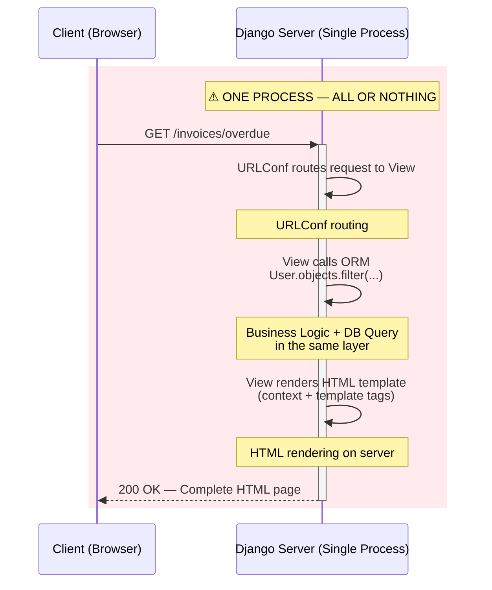
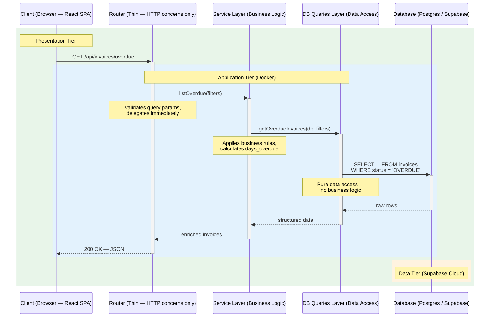

# Architecture Comparison: Traditional Monolith vs Decoupled Architecture

## Diagram 1 — Traditional Monolith (Django MVT)

> Everything runs in a single process. The View owns business logic, DB access, and HTML rendering.
> No layer can be deployed, scaled, or tested independently.

### Problems

| # | Issue | Consequence |
|---|-------|-------------|
| 1 | **Single process** | One memory space, one failure domain — the entire app crashes together |
| 2 | **Logic + DB + HTML in one layer** | Cannot test business logic without mocking the full HTTP stack |
| 3 | **Server-rendered HTML** | Every interaction requires a full page reload — poor UX |
| 4 | **Tight coupling** | Changing the DB schema risks breaking the template; changing the template requires redeploying the whole app |
| 5 | **Vertical scaling only** | To handle more traffic, you must scale the entire monolith — expensive |

---

## Diagram 2 — Decoupled Architecture (Your Project)

> Three independent tiers communicate over the network. Each has a single responsibility.
> Within the Application Tier, code is further separated into three layers.

### Benefits

| # | Advantage | Why |
|---|-----------|-----|
| 1 | **Independent scaling** | React can be served from a CDN; the API can be horizontally scaled; the DB can be scaled separately |
| 2 | **Independent deployment** | Frontend changes don't require backend redeploy and vice versa |
| 3 | **Isolated testing** | The Service Layer can be tested with pure Python — no HTTP, no browser |
| 4 | **Single responsibility** | Each layer has one job: Router handles HTTP, Service handles logic, DB Queries handles data |
| 5 | **Technology flexibility** | Frontend could be replaced with a mobile app without touching the backend |

---

## Side-by-Side Comparison

| Dimension | Monolith (Django MVT) | Your Architecture |
|---|---|---|
| **Runtime structure** | Single process | Three tiers (Browser → Docker → Cloud DB) |
| **Deployment unit** | One | Three independent units |
| **Code organization** | Fat View (logic + DB + HTML) | Router → Service → DB Queries |
| **Frontend rendering** | Server (Django Templates) | Client (React SPA) |
| **Business logic location** | Scattered in View / Model | Centralized in Service Layer |
| **Database access** | ORM inline in View | Isolated in DB Queries layer |
| **Testability** | Requires HTTP client for logic tests | Pure unit tests for Service layer |
| **Scalability** | Vertical (scale the whole app) | Horizontal per tier |
| **Failure isolation** | Any bug crashes everything | One tier can fail without taking down others |
| **Technology lock-in** | Tightly coupled to Django | Each tier is independently replaceable |
