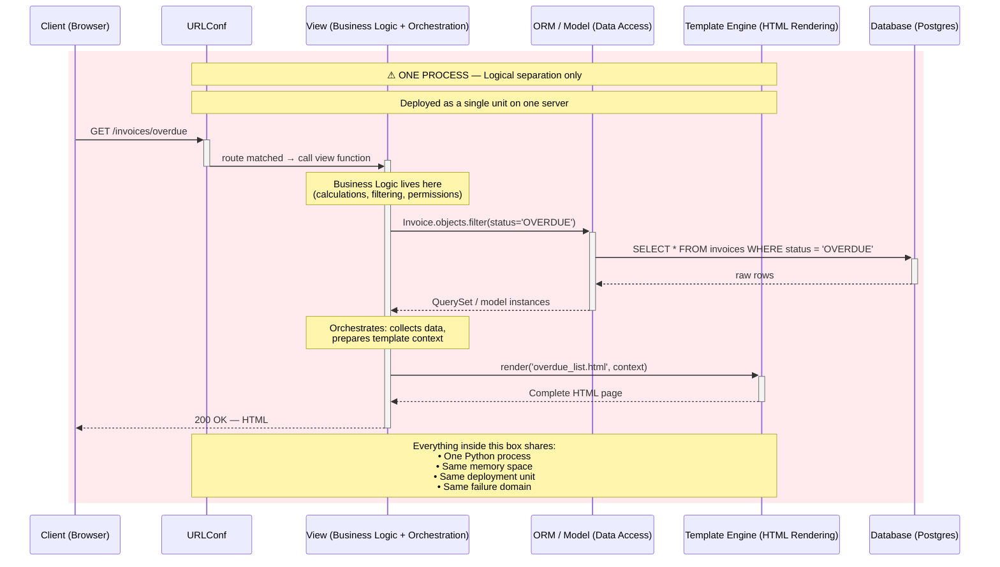
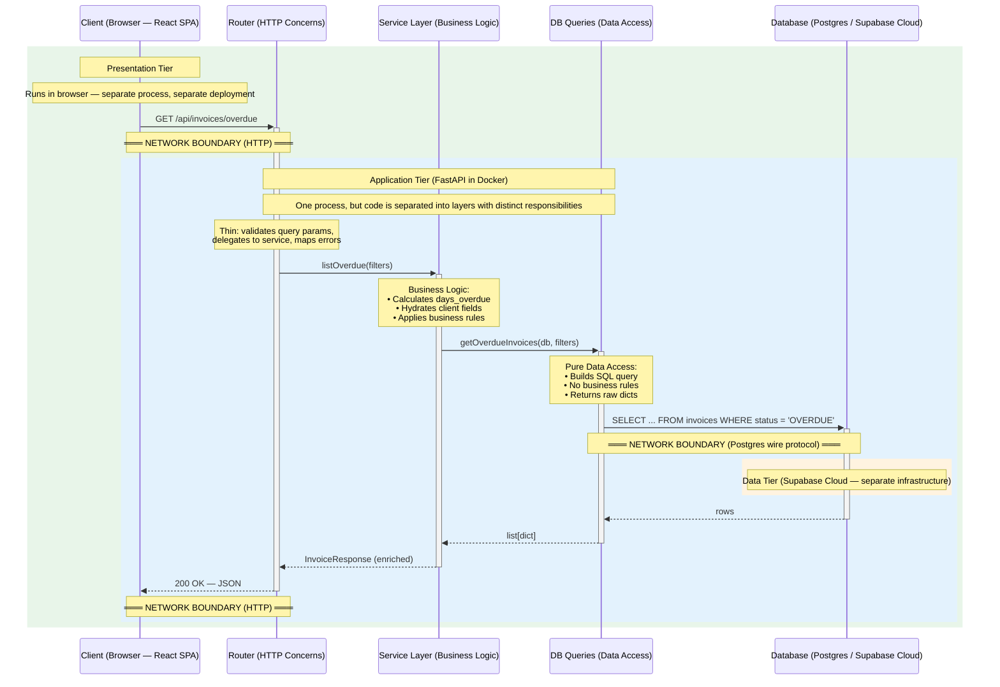

# Architecture Comparison: Traditional Monolith vs Decoupled Architecture

## Diagram 1 — Traditional Monolith (Django MVT)

> All backend participants (URLConf, View, ORM/Model, Template Engine) run inside **one process**.
> They share memory, state, and the same deployment lifecycle. The dashed line is logical, not physical.

### What this means in practice

| Characteristic | Why it matters |
|---|---|
| **All logic in View** | The View owns business rules, DB queries, template preparation, and response construction — it's the "Fat Controller" |
| **Server-rendered HTML** | Every click requires a full round-trip; the server does all the presentation work |
| **Single process coupling** | A memory leak in the ORM crashes the template engine; a slow DB query blocks HTML rendering for all users |
| **Deployment** | Changing one line in a template requires redeploying the entire application |

---

## Diagram 2 — Decoupled Architecture (Your Project)

> Each participant runs in a **different process**, separated by network boundaries.
> Within the backend process, code is further organized into three logical layers with single responsibilities.

### What this means in practice

| Characteristic | Why it matters |
|---|---|
| **Business Logic in Service Layer** | Router doesn't compute — it delegates. Service is pure Python, testable without HTTP |
| **JSON response, not HTML** | The client decides how to render the data. React, mobile app, or CLI — same API |
| **Network boundaries** | Each tier can fail, scale, and deploy independently. A DB slowdown doesn't block the React app from loading |
| **Deployment** | Frontend can be deployed to a CDN; backend to Docker; DB managed by Supabase — all independent |

---

## Side-by-Side Comparison

| Dimension | Monolith (Django MVT) | Your Architecture |
|---|---|---|
| **Process structure** | One process for all backend logic | Three tiers (Browser → Docker → Cloud DB) |
| **Deployment unit** | One (the entire app) | Three independent units |
| **Code organization** | Logic in View / Model | Router → Service → DB Queries |
| **Request output** | HTML (server-rendered) | JSON (client-rendered) |
| **Business logic location** | Scattered across View and Model | Centralized in Service Layer |
| **Database access** | ORM inline in View / Model | Isolated in DB Queries layer |
| **Testability** | Need HTTP client to exercise logic | Service tested with pure Python calls |
| **Scalability** | Vertical — scale the whole monolith | Horizontal per tier |
| **Failure isolation** | Any exception can crash the process | One tier can degrade without taking down others |
| **Frontend flexibility** | Tied to server templates | Any client can consume the API |
