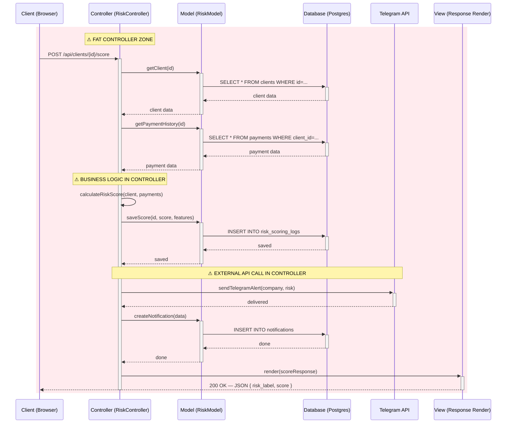
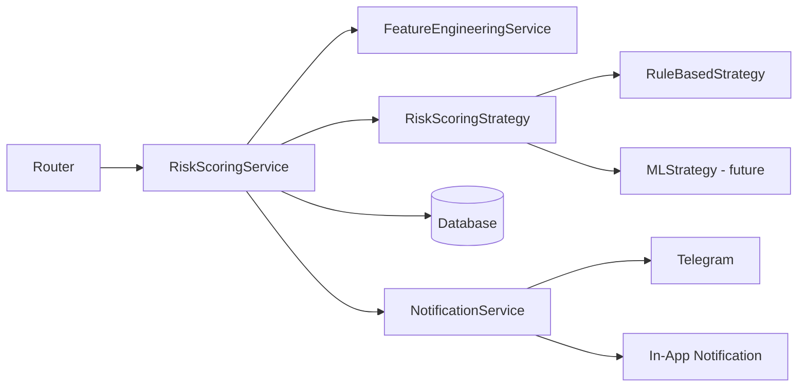

# Risk Scoring Pipeline — Classic MVC Pattern

> The "Fat Controller" problem: business logic, external API calls, and DB orchestration all crammed into one layer.

## Key Observations

| # | Problem | Impact |
|---|---------|--------|
| 1 | **Business Logic in Controller** — the risk scoring formula, weights, and thresholds are computed directly in the Controller | Cannot unit-test the formula without simulating an HTTP request |
| 2 | **External API Call in Controller** — Telegram notification dispatched directly | If Telegram is down, the HTTP request hangs |
| 3 | **Multiple DB Round-Trips** — Controller micromanages every database call | Violates Law of Demeter; brittle to schema changes |
| 4 | **No Reusability** — a Celery worker needs the same logic | Must copy-paste all of the above; no single `score_client()` to call |

## Solution: Service Layer

The **Service Layer** extracts all orchestration into `RiskScoringService`, so:

1. Both the **Router** and the **Celery Worker** call `service.score_client(id)` — no duplication
2. The scoring formula is pluggable via the `RiskScoringStrategy` Protocol (Open/Closed Principle)
3. External side-effects (Telegram, notifications) are isolated in dedicated services
4. Pure logic, testable without HTTP context
