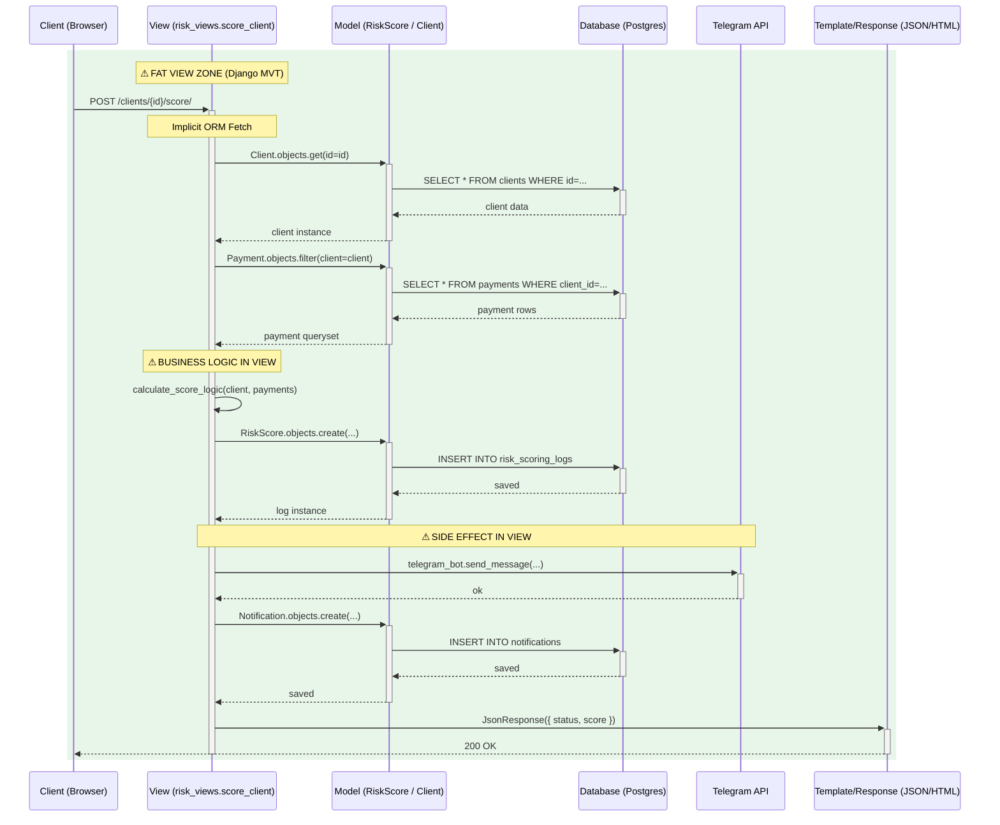
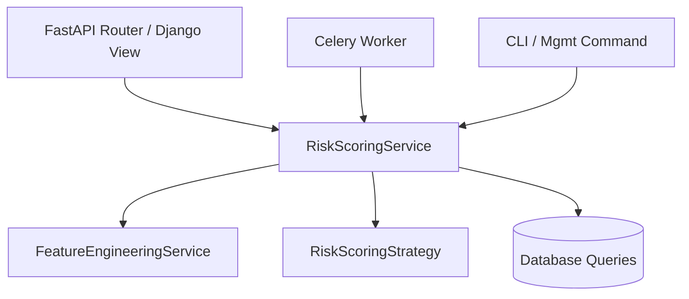

# Risk Scoring Pipeline — Classic MVT Pattern

> The "Fat View" problem: business logic, ORM orchestration, and side effects all crammed into the Django View layer.

## Key Observations (The Django Context)

| # | Problem | Impact |
|---|---------|--------|
| 1 | **Business Logic in View** — The "V" in MVT acts as the orchestrator for weights, thresholds, and math. | The View becomes untestable without a mocked `HttpRequest`. Logic cannot be shared with `management commands`. |
| 2 | **ORM Over-Reliance** — The view micromanages multiple `filter()` and `get()` calls. | Leads to "N+1" query issues and makes the view tightly coupled to the database schema. |
| 3 | **Side Effects in View** — Dispatching Telegram messages or external API calls inside the request-response cycle. | A slow external API (Telegram) blocks the entire worker process, leading to timeouts for the user. |
| 4 | **Request Coupling** — Logic is often tied to `request.user` or `request.POST`. | Makes it impossible to trigger the same risk scoring from a background Celery task or an admin action. |

## Solution: The Service Layer (Current Implementation)

In our FastAPI codebase, we avoid the **Fat View** (MVT) or **Fat Controller** (MVC) by using a dedicated **Service Layer**.

By extracting the orchestration into `RiskScoringService`:
1. **Thin Entry Points**: Routers and Workers are just "callers" of the service.
2. **Isolated Logic**: The scoring strategy is a pure Python object, easily testable.
3. **Decoupled DB**: Database interactions are isolated in the `db/queries/` layer.
4. **Reliability**: Side effects (Telegram) are handled by a `NotificationService` or backgrounded immediately.